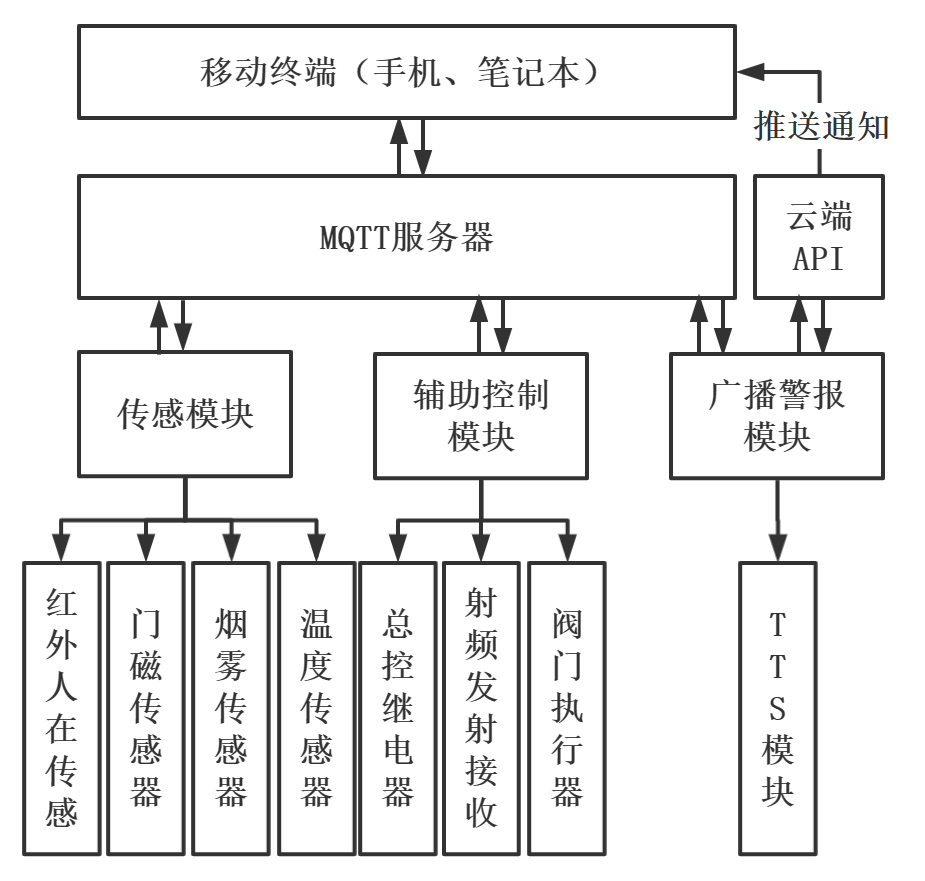
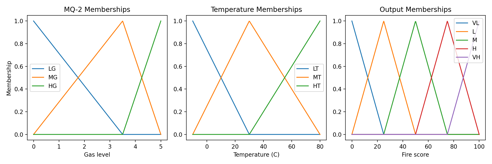
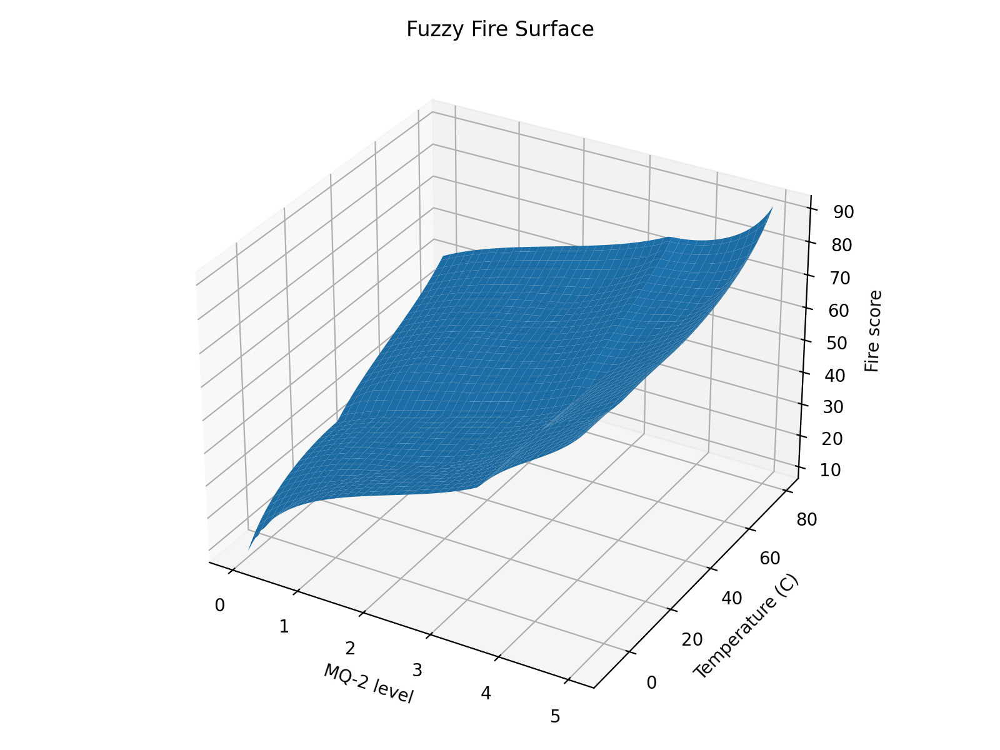

<a id="top"></a>

<div align="center">
  <h1>🏠 Multiscene Smart Home Security System</h1>
  <p><strong>ESP8266 • MQTT • Fuzzy Fire Detection • TTS Broadcast • Mobile Alerts</strong></p>
  <p>Undergraduate thesis project showcase for a distributed 3-node smart home security prototype.</p>
  <p>
    <a href="#jp"><kbd>🇯🇵 日本語版</kbd></a>
    <a href="#en"><kbd>🇺🇸 English Version</kbd></a>
  </p>
</div>

---

<a id="jp"></a>

## 🇯🇵 日本語版

[<kbd>⬇️ English へ移動</kbd>](#en)

> 📘 卒業論文「面向多场景的智慧家庭安防系统设计」をもとにした、ESP8266 / Arduino IDE / MQTT ベースの分散型ホームセキュリティ試作システムです。

### ✨ 概要

このプロジェクトは、家庭内の複数リスクを 1 つの仕組みで扱うことを目的とした研究試作です。  
3 台の ESP8266 ノードを MQTT で接続し、火災監視、侵入検知、屋内放送、スマホ通知、補助制御を連携させます。

現在のリポジトリは、公開向けのプロジェクト紹介と図版整理を中心にしています。

### 🧭 想定シーン

- 👵 室内見守り
- 🔥 火災監視
- 🚨 防犯・侵入検知
- ⚙️ 補助制御

### 🛰️ 3 ノード構成

- `sensor_node`: MQ-2 / DHT11 / PIR / ドアセンサを読み取り、火災リスクを推定
- `control_node`: サーボ、リレー、433 MHz 制御で緊急時の物理アクションを実行
- `broadcast_node`: TTS 放送、天気通知、スマホへの Gotify 通知を担当

### 🖼️ 論文から選んだ掲載向け図

<p align="center">
  
</p>

<p align="center"><em>図 1 整機設計ブロック図</em></p>

<p align="center">
  
</p>

<p align="center"><em>図 2 ファジィメンバーシップ関数</em></p>

<p align="center">
  
</p>

<p align="center"><em>図 3 ファジィ曲面</em></p>

### 📡 MQTT トピック設計

| Topic | 用途 |
| --- | --- |
| `smart-home-security/event/fire` | 火災イベント JSON |
| `smart-home-security/event/intrusion` | 侵入イベント JSON |
| `smart-home-security/event/broadcast` | 放送メッセージ JSON |
| `smart-home-security/event/telemetry` | 周期テレメトリ JSON |
| `smart-home-security/command/control` | 制御コマンド JSON |

### 🧪 火災イベント例

```json
{
  "module": "sensor-node",
  "event": "fire",
  "source": "sensor",
  "severity": "alert",
  "score": 45.3,
  "gas_level": 2.5,
  "temperature_c": 35.0,
  "pir": false,
  "door_open": false,
  "armed": true
}
```

### 🔍 このプロジェクトの見どころ

- 🔥 `MQ-2 + DHT11` を入力とするファジィ火災判定で、単純なしきい値判定より誤報を減らす設計
- 📢 屋内 TTS 放送とスマホ通知を組み合わせ、現場と遠隔の両方に警報を届ける構成
- ⚡ 火災時にはサーボ、リレー、433 MHz 制御を連動させ、実際のアクションまで自動化
- 🌦️ 天気 API と連携し、高齢者見守りに役立つ悪天候リマインドも実装可能

[<kbd>⬇️ English Section</kbd>](#en)

---

<a id="en"></a>

## 🇺🇸 English Version

[<kbd>⬆️ Back to Japanese</kbd>](#jp) [<kbd>⬆️ Top</kbd>](#top)

> 📘 This repository presents an undergraduate thesis project called "Design of a Multiscene Smart Home Security System," built around ESP8266, Arduino IDE, and MQTT.

### ✨ Overview

This is a distributed smart home security prototype designed to coordinate multiple household safety scenarios in one system.  
Three ESP8266 nodes communicate through MQTT and work together for fire monitoring, intrusion detection, indoor broadcasting, weather reminders, and mobile alert delivery.

At the moment, this repository mainly serves as a public-facing project overview plus a curated set of thesis figures.

### 🧭 Target Scenarios

- 👵 Indoor care and daily reminders
- 🔥 Fire monitoring
- 🚨 Intrusion protection
- ⚙️ Auxiliary control and emergency actuation

### 🛰️ 3-Node Design

- `sensor_node`: Reads MQ-2, DHT11, PIR, and door sensors, then estimates fire risk
- `control_node`: Executes physical responses through servo, relay, and 433 MHz control
- `broadcast_node`: Handles TTS announcements, weather reminders, and Gotify mobile notifications

### 🖼️ Selected Thesis Figures

<p align="center">
  
</p>

<p align="center"><em>図 1 整機設計ブロック図</em></p>

<p align="center">
  
</p>

<p align="center"><em>図 2 ファジィメンバーシップ関数</em></p>

<p align="center">
  
</p>

<p align="center"><em>図 3 ファジィ曲面</em></p>

### 📡 MQTT Topic Layout

| Topic | Purpose |
| --- | --- |
| `smart-home-security/event/fire` | Fire event payloads in JSON |
| `smart-home-security/event/intrusion` | Intrusion event payloads in JSON |
| `smart-home-security/event/broadcast` | Broadcast message payloads in JSON |
| `smart-home-security/event/telemetry` | Periodic telemetry payloads in JSON |
| `smart-home-security/command/control` | Control commands in JSON |

### 🧪 Example Fire Event

```json
{
  "module": "sensor-node",
  "event": "fire",
  "source": "sensor",
  "severity": "alert",
  "score": 45.3,
  "gas_level": 2.5,
  "temperature_c": 35.0,
  "pir": false,
  "door_open": false,
  "armed": true
}
```

### 🔍 Highlights

- 🔥 Fuzzy fire inference combines `MQ-2` gas readings with `DHT11` temperature data instead of relying on a single threshold
- 📢 TTS indoor broadcasting and mobile notifications help the system reach both people inside the home and remote caregivers
- ⚡ Servo, relay, and 433 MHz actions allow the system to react physically during emergencies
- 🌦️ Weather API integration extends the project beyond security into practical elderly-care reminders

[<kbd>⬆️ Back to Japanese</kbd>](#jp) [<kbd>⬆️ Top</kbd>](#top)
